#  JotForm Builder

A powerful, intuitive drag-and-drop form builder that empowers users to create
stunning, responsive forms with ease. Build professional forms by simply
dragging field components from our comprehensive toolbox. Customize every aspect
with our advanced theme editor - from colors and typography to layout and
styling. Perfect for developers, designers, and anyone who wants to create
beautiful forms without coding!

**Built with:** Next.js, React, TypeScript, Tailwind CSS

## ✨ Key Features

-   **🎨 Intuitive Drag & Drop**: Effortlessly build forms by dragging field
    components from our comprehensive toolbox
-   **👁️ Real-time Preview**: Instantly switch between edit and preview modes to
    see your form come to life
-   **🎭 Advanced Theme System**: Customize colors, fonts, typography, and
    styling with our powerful theme editor
-   **✅ Smart Validation**: Built-in validation for email, numbers, required
    fields, and custom patterns
-   **💾 Seamless Export/Import**: Save your forms as JSON files and share them
    across projects
-   **📱 Fully Responsive**: Beautiful forms that work perfectly on desktop,
    tablet, and mobile devices

## 🛠️ Technologies Used

-   **Next.js** - React framework
-   **TypeScript** - JavaScript with types
-   **Tailwind CSS** - Styling
-   **React DnD** - Drag and drop
-   **Zod** - Form validation

## 🚀 How to Run

### ✅ **Comprehensive Validation**

-   **Real-time Validation**: Instant feedback on form validation
-   **Multiple Validation Types**: Email, number, required fields, and custom
    patterns
-   **Zod Integration**: Type-safe schema validation
-   **Error Display**: Clear error messages with visual indicators
-   **Form Submission**: Complete submission flow with success states

### 💾 **Import/Export System**

-   **JSON Export**: Export form configurations as downloadable JSON files
-   **JSON Import**: Import previously saved form configurations
-   **Save Functionality**: Save forms with custom handlers
-   **File Management**: Clean filename generation and validation

### 📱 **Responsive Design**

-   **Mobile-First**: Optimized for all screen sizes
-   **Touch-Friendly**: Drag and drop works on mobile devices
-   **Adaptive Layout**: Components adjust to different viewport sizes
-   **Modern UI**: Clean, professional interface with smooth animations

## 🚀 Getting Started

### Prerequisites

-   **Node.js** 18 or higher
-   **npm** or **yarn** package manager

### Installation

1. **Clone the repository**

    ```bash
    git clone https://github.com/yourusername/jotform-builder.git
    cd jotform-builder
    ```

2. **Install dependencies**

    ```bash
    npm install
    npm run dev
    ```

3. **Open browser** and go to `http://localhost:3000`

## 📖 How to Use

### Building Forms

1. **Drag fields** from the left toolbox to the center area
2. **Click "Edit"** on any field to change its settings
3. **Click "Preview"** to see how your form looks
4. **Save or Export** your form when done

### Changing Themes

1. **Click "Theme"** button in the top bar
2. **Choose colors** and fonts
3. **Click "Apply Theme"** to save changes

### Saving Forms

-   **Export**: Download your form as a JSON file
-   **Import**: Load a previously saved form

## 📁 Project Structure



### Main Files

```
src/
├── app/                    # Next.js app directory
│   ├── globals.css        # Global styles and CSS variables
│   ├── layout.tsx         # Root layout component
│   └── page.tsx           # Main page component
├── components/            # React components
│   ├── drag-drop/        # Drag and drop functionality
│   │   ├── DraggableField.tsx
│   │   └── DroppableFormArea.tsx
│   ├── field-editor/     # Field editing modal
│   │   └── FieldEditor.tsx
│   ├── field-palette/    # Field selection palette
│   │   └── FieldPalette.tsx
│   ├── form-builder/     # Main form builder
│   │   └── FormBuilder.tsx
│   ├── form-fields/      # Individual field components
│   │   ├── BaseField.tsx
│   │   ├── CheckboxField.tsx
│   │   ├── FieldFactory.tsx
│   │   └── RadioField.tsx
│   ├── form-preview/     # Form preview component
│   │   └── FormPreview.tsx
│   ├── theme-editor/     # Theme customization
│   │   └── CustomThemeEditor.tsx
│   └── ui/               # Reusable UI components
│       ├── Button.tsx
│       ├── Input.tsx
│       ├── Modal.tsx
│       ├── Navbar.tsx
│       └── index.ts
├── contexts/             # React contexts
│   └── CustomThemeContext.tsx
├── data/                 # Static data files
│   ├── colorInputs.json
│   ├── darkTheme.json
│   ├── defaultFormConfig.json
│   ├── lightTheme.json
│   ├── themes.json
│   └── typographyInputs.json
├── hooks/                # Custom React hooks
│   ├── useFieldEditor.ts
│   ├── useFieldManipulation.ts
│   └── useModalState.ts
├── types/                # TypeScript type definitions
│   └── form.ts
└── utils/                # Utility functions
    ├── fileUtils.ts
    ├── validation.ts
    └── zodValidation.ts
```

## 🔧 How It Works

-   **FormBuilder** - Main controller that manages everything
-   **FieldPalette** - Left toolbox with draggable field types
-   **DroppableFormArea** - Center area where you build forms
-   **FormPreview** - Shows final form with validation
-   **CustomThemeEditor** - Theme customizer popup

## 🎨 Theme System

Themes use CSS variables that change colors and fonts across the entire app.
Changes are saved automatically.

---

**Made for Assignment Submission Infoware**
